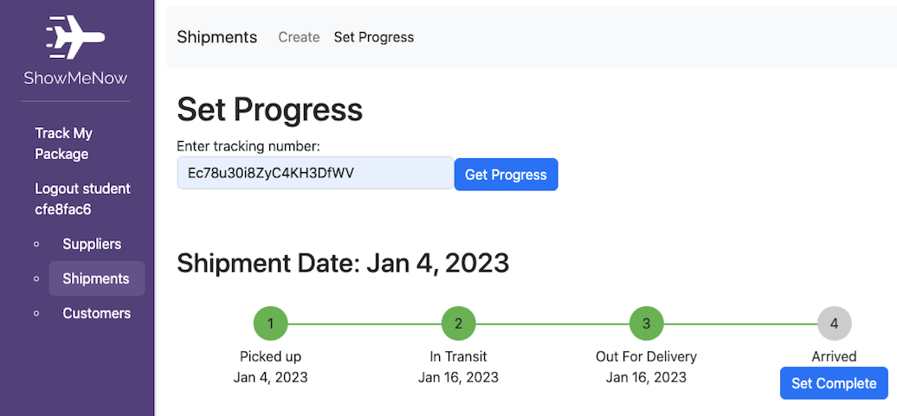
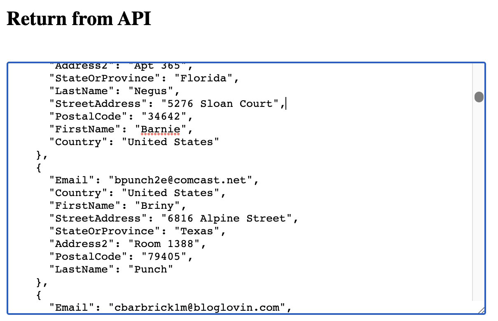

# Introduction to the Legacy


## Situational overview

Welcome to MegaHot Corp., stylized as MHC. You've join the MHC technology team. You are the product lead for the new application “Show Me Now", stylized as SMN.



MHC has identified that many logistic companies have limited tracking information provided to their customers. Often the tracking is not updated until the package has reached the destination. 

The developers on your team have identified that more in-depth tracking details can be obtained from a legacy application. This system is currently part of the call center stack and as a result, there can be no change to this application. 

Show Me Now aims to extract this information and make it available to customers. Management has identified that SMN will reduce the number of calls to your call center as users will have a more in-depth picture. 

SMN will be released as a web application and as a set of APIs for use by third parties. 

You will explore how to deliver SMN in a secure way using Apigee. Each lab will see you approach a different task until you have a complete solution.

Along the way, you will be able to experiment with the data. Can you break it? Can you bring out your hacking skills? The best way to secure any application is to break it first to find the weaknesses and to lock them down.

We have the tools but how do we implement them?

## Overview

In this lab, you explore the legacy API that is deployed in a Google Compute Engine instance. The API is publicly exposed, and there is no security. You search for and uncover the security vulnerabilities in the API. In later labs, you use Apigee to correct these vulnerabilities.

## Objectives

In this lab, you learn how to:
- Exploit security vulnerabilities in a legacy API using a test page left in place by the development team 
- Remove public access to an API deployed to Compute Engine


## Setup and Requirements

![[/fragments/start-qwiklab]]


![[/fragments/cloudshell]]


![[/fragments/apigeex-console]]

## Task 1. Explore the Legacy API

1. In the Google Cloud console, from the Navigation menu (), select __Compute Engine and VM instances__.

2. In the Compute Engine VM instances pane, locate the VM named __legacy-api__ and copy the __External IP__. Open a new browser tab and paste the IP address into the address bar.

    <ql-infobox>
    The developer of the legacy API appears to have left a test page exposed. You should see the “Shipping API Tester”.
    </ql-infobox>

3. Select the following: (Hint: They are prepopulated.)

    | Property | Value |
    | --- | --- |
    | METHOD | **GET** |
    | PATH | **/v1/customers** |
    | EMAIL | **abischof1d@google.com** |

4. Click **Send**. You should see the customer details in the **Return from API** text box.

    <ql-infobox>
    This shows that the legacy API returns specific data when requested. But what happens if you make a less specific request than the developer intended?
    </ql-infobox>

5. Remove the email address and click **Send**. This time the API exposes all of MHC’s customers.

    <ql-infobox>
    Hint: If the Return from API box is too small, you can drag the handle in the bottom-right corner to resize.
    </ql-infobox>

    

6. Change the **Path** and experiment to discover if __orders__ and __shipments__ have the same vulnerability as __customers__.

## Task 2. Investigate security vulnerabilities

1. Refresh the Shipping API Tester and then select and set the following:

    | Property | Value |
    | --- | --- |
    | METHOD | **GET** |
    | PATH | **/v1/customers** |
    | EMAIL | **hacked@google.com** |

2. Click **Send** and examine the return, if any.

    <ql-infobox>
    The API returns an empty object inside a result array. This customer does not exist.
    </ql-infobox>

3. Remove the email address from the text box and click **Send** to return all customer records.

4. Copy any JSON object from the output, or use the example below. Be careful to include both the object's surrounding curly braces { }. 

    ```json
    {
      "Email": "abischof1d@google.com",
      "StateOrProvince": "Florida",
      "FirstName": "Anastasia",
      "Address2": "Room 496",
      "PostalCode": "32825",
      "LastName": "Bischof",
      "Country": "United States",
      "StreetAddress": "83480 Sachtjen Parkway"
    }
    ```

5. Paste the JSON object into the __JSON Payload (optional)__ text box and change the Email from *abischof1d@google.com* to __hacked@google.com__.

6. Confirm that the JSON Payload is similar to this:

    ```json
    {
      "Email": "hacked@google.com",
      "StateOrProvince": "Florida",
      "FirstName": "Anastasia",
      "Address2": "Room 496",
      "PostalCode": "32825",
      "LastName": "Bischof",
      "Country": "United States",
      "StreetAddress": "83480 Sachtjen Parkway"
    }
    ```

7. Change the **Method** to **Post** and click **Send**. You should see the following message:

    ```json
    {
      "api": "Customers",
      "msg": "Customer created or updated"
    }
    ```

    <ql-infobox>
    The test page allows customers to be added to MHC’s database without any validation or security. 
    </ql-infobox>

8. Select or set the following and click **Send**:

    | Property | Value |
    | --- | --- |
    | METHOD | **Get** |
    | PATH | **/v1/customers** |
    | EMAIL | **hacked@google.com** |

9. Verify that you now see a customer record for hacked@google.com

10.  Bonus: Try altering different fields and emails. Do you see more customer records?

## Task 3. Explore the severity of the security vulnerabilities

1. Refresh the **Shipping API Tester** and then set the following as the entire content of the JSON Payload text box:

    ```json
    {
        "Email": "hacked@google.com",
        "PostalCode": "32825",
        "StateOrProvince": "Florida",
        "LastName": "Bischof",
        "FirstName": "Anastasia",
        "Country": "United States",
        "Address2": "Room 496",
        "StreetAddress": "83480 Sachtjen Parkway"
      }
    ```
2. Add the following snippet of JSON immediately after the opening {

    ```json
    "Junk " :  "This is a very vulnerable API",  
    ```

3. Your JSON Payload should look like this:

    ```json
    {
      "Junk " : "This is a very vulnerable API",  
      "Email": "hacked@google.com",
      "PostalCode": "32825",
      "StateOrProvince": "Florida",
      "LastName": "Bischof",
      "FirstName": "Anastasia",
      "Country": "United States",
      "Address2": "Room 496",
      "StreetAddress": "83480 Sachtjen Parkway"
      }
    ```

4. Change the **Method** to **Post** and click **Send**. You should see the following message:

    ```json
    {
      "api": "Customers",
      "msg": "Customer created or updated"
    }
    ```

    <ql-infobox>
    If you don’t see the above message, your JSON payload was probably malformed. Check for missing commas, quotation marks, and curly braces.
    </ql-infobox>

5. Select or set the following and click **Send**:

    | Property | Value |
    | --- | --- |
    | METHOD | **GET** |
    | PATH | **/v1/customers** |
    | EMAIL | **hacked@google.com** |

6. Confirm that the __Junk__ field is now part of the returned record. 

## Task 4. Reduce the attack vector

The Legacy API is highly insecure and cannot be used in its current state. We will explore ways to secure access in subsequent labs. For now, we need to implement a quick security fix by removing the external IP address from the VM.

1. In the Google Cloud console, from the Navigation menu (), select __Compute Engine and VM instances__.

2. In the Compute Engine VM instances pane, click the link __legacy-api__ in the __Name__ column.

3. In the top menu bar on the next page, click **Edit**. 

4. In the **Network interfaces** section, click the **mhc-network mhc-subnetwork** network interface to open the __Edit network interface__ dialog. 

5. Click the **External IP v4 address** dropdown and change the value to **None** to remove the External (Public) IP Address, and then click __Done__ and __Save__.

    

6. From the side menu, select **VM Instances**. Verify that the legacy-api VM no longer has an entry in the **External IP** column.

### **Congratulations!** You have established that the legacy API has significant security vulnerabilities. You removed the External (Public) IP Address to ensure that it is no longer accessible except to other internal MHC systems.

![[/fragments/copyright]]
