# Securing Backend Access

## Overview

In this lab, you lay the framework for a secure connection from Apigee to the legacy API. You enable access to the API using an mTLS connection.

## Objectives

In this lab, you learn how to:
- Implement a second VM to work as a Gateway (reverse proxy) between the public and private networks 
- Implement mTLS between the Gateway and Apigee
- Establish an initial connection to Apigee


## Setup and Requirements


![[/fragments/start-qwiklab]]


![[/fragments/cloudshell]]


![[/fragments/apigeex-console]]


## Task 1. Explore the gateway

1. In the Google Cloud console, from the Navigation menu (), select __Compute Engine and VM instances__.

2. In the Compute Engine VM instances pane, locate the VM named __gateway__ and copy the __External IP__. Open a new browser tab and paste the IP address into the address bar.

    <ql-infobox>
    You should see that you can again get access to the <b>Shipping API Tester</b>. This is because the VM has been provisioned with NGINX to operate as a reverse proxy.
    </ql-infobox>

3. Return to the Cloud console and click **Activate Cloud Shell** () in the top menu to open Cloud Shell.

4. In Cloud Shell, set the default compute zone to the zone used by the gateway vm, replacing [us-east1-b] in the following code with your zone.

    ```bash
    gcloud config set compute/zone [us-east1-b]
    ```

    <ql-infobox>
    <b>gcloud</b> is the command-line tool for Google Cloud. It comes pre-installed on Cloud Shell and supports tab completion.
    </ql-infobox>

5.  Connect to the gateway VM and inspect the configuration of the reverse proxy.

    ```bash
    gcloud compute ssh gateway 
    ```

6. When the prompt changes indicating you are connected to the gateway, execute the following command.

    ```bash
    cat /etc/nginx/sites-enabled/reverse-proxy.conf 
    ```

7. Confirm that the output is similar to this.

    ```code
    server {
      listen 80;
      location / {
          proxy_pass http://10.138.0.2;
      }
    }
    ```

    <ql-infobox>
    The actual IP address is the IP address of your legacy API VM.
    </ql-infobox>

8. This configuration tells Nginx to pass any incoming requests on to the internal IP of our legacy API. This recreates the problem from Lab 1; the insecure API is once again exposed to the internet.

9. In Cloud Shell, type **exit** to terminate the SSH session and return your terminal session to the Cloud Shell instance.

10. Verify that the prompt has changed from username@**gateway** to username@**cloudshell**. You should also see the project id in yellow. 


## Task 2. Generate and install the certificates

You implement Mutual Transport Layer Security (mTLS) to force connections to present a client certificate to access the gateway and the legacy API. A helper script and updated gateway configuration have been created to assist in generating and applying a certificate authority and client/server certificates. 

1.  To ensure that you are in the Cloud Shell home directory, execute the following command.

    ```bash
    cd ~ 
    ```

2. Clone the class repository and move into the repository root folder.

    ```bash
    git clone https://github.com/fabltd/Apigee-utils
    cd Apigee-utils
    ```

3. To ensure the default compute zone is still set, once again execute the following command, replacing [us-east1-b] with your zone.

    ```bash
    gcloud config set compute/zone [us-east1-b]
    ```

    <ql-infobox>
    If Cloud Shell has disconnected at any point during the above steps, the default zone may no longer be set.
    </ql-infobox>

4. To set up the certificates, execute the following code to run the certs helper.

    ```bash
    ./student-scripts/certs.sh
    ```
    <ql-infobox>
    Be careful not to miss the ./ before certs.sh
    </ql-infobox>

5. To verify that the helper created a directory called mTLS that contains the certificates, execute the following command.

    ```bash
    ls ~/Apigee-utils/mTLS
    ```

    <ql-infobox>
    You should see three directories: ca, server, apigee
    </ql-infobox>

6. To check the validity of the new certificate authority, execute the following command.

    ```bash
    openssl x509 -in ~/Apigee-utils/mTLS/ca/ca.crt -text -noout
    ```

    <ql-infobox>
    The Validity section at the top of the text output shows that our CA is valid for one year. 
    </ql-infobox>

7. To install the server certificates/certificate and authority to the gateway and reconfigure NGINX to use mTLS, execute the following command to run a helper script.

    ```bash
    cd ~/Apigee-utils/student-scripts
    ./server-config.sh 
    ```

    <ql-infobox>
    This script uses <b>gcloud compute scp</b> (secure copy protocol) to add the files to the gateway.
    </ql-infobox>

8.  You can inspect the script to see the commands that are implemented here.

    ```bash
    cat ~/Apigee-utils/student-scripts/server-config.sh
    ```

    <ql-infobox>
    The script sets a Compute Engine zone environment variable, then copies the certificates to the Compute Engine instance (VM), moves these to the correct location, and copies over a revised NGINX conf.
    </ql-infobox>

9. Verify that the compute/zone is still set by executing the following command.

    ```bash
    gcloud config get-value compute/zone
    ```

    <ql-infobox>
    If the value is <b>unset</b>, use the command in step 3 above to set the compute/zone.
    </ql-infobox>

10. To test your work and present a client certificate to the gateway, execute the following command to run a helper script. 

    ```bash
    cd ~
    ./Apigee-utils/student-scripts/mTLS-test.sh
    ```

    **SAMPLE OUTPUT (Truncated for Readability)**

    ```bash
    Testing mTLS Certs
    Your active configuration is: [cloudshell-27263]
    Updated property [compute/zone].

      % Total    % Received % Xferd  Average Speed   Time    Time     Time  Current
                                    Dload  Upload   Total   Spent    Left  Speed
    100  2756  100  2756    0     0  95034      0 --:--:-- --:--:-- --:--:-- 95034
      <title>Shipping API Tester</title>
          <h1>Shipping API Tester</h1>
    ```

11. Verify that your output contains the final two lines from the above example, with the text __Shipping API Tester__. The fact that you can see the title from the legacy API test page verifies that your certificate chain is working. 

    <ql-infobox>
    The script uses a certificate named <b>apigee</b>.  This is an arbitrary name created by the script that you ran to create the certificates. It is named apigee because Apigee is the client of the gateway. 
    </ql-infobox>

12. To find the **External IP** of the gateway, execute the following command.

    ```
    gcloud compute instances list 
    ```

    **SAMPLE OUTPUT (Truncated for Readability)**

    ```bash
    NAME: gateway
    ZONE: us-west1-b
    MACHINE_TYPE: e2-micro
    PREEMPTIBLE:
    INTERNAL_IP: 10.138.0.2
    EXTERNAL_IP: 35.247.91.33
    STATUS: RUNNING
    ```

13. Locate the value of the **EXTERNAL_IP** for the gateway VM from the output and execute the following command, replacing [EXTERNAL_IP] with the IP address.

    ```bash
    curl -k https://[EXTERNAL_IP]  -v 
    ```

    <ql-infobox>
    The -k flag tells curl to ignore any certificate errors.
    </ql-infobox>

    **SAMPLE OUTPUT (Excerpted for Readability)**

    ```bash
    *   Trying 34.23.241.110:443...
    * Connected to 34.23.241.110 (34.23.241.110) port 443 (#0)
    
    * Server certificate:
    *  subject: CN=Server
    
    < HTTP/1.1 418
    ```

    <ql-infobox>
    In the output, <b>CN</b> is Common Name, set in our script. The port on the gateway is 443 as this is https traffic. The 418 status code is the NGINX error code configured by our script to be returned when no client certificate is provided to validate the request. 
    </ql-infobox>


## Task 3. Configure Apigee for mTLS

You have now configured sufficient infrastructure to allow you to set up Apigee with a  reverse proxy and mTLS configuration. This allows you to call the legacy backend. However, it once again exposes the insecure legacy API. You correct this in a later lab using Apigee policies.

1. In a different browser tab within the same window, open the Apigee console at [apigee.google.com](https://apigee.google.com/).

    <ql-infobox>
    The Apigee console is accessed on a different URL from the Google Cloud console. An Apigee organization with the same name as the Google Cloud project has been created for you.
    </ql-infobox>

    Alternatively, to open the Apigee console from the Google Cloud console Navigation menu (), select <b>Tools > Apigee</b>.

2. In the left navigation menu of the Apigee browser tab, select **Develop > API Proxies**.

3. To start the [proxy wizard](https://cloud.google.com/apigee/docs/api-platform/fundamentals/build-simple-api-proxy), click **Create New**.

4. Click the **Reverse proxy** box. 

5. Set the following properties, replacing [EXTERNAL-IP] with the External IP address of the __gateway__ VM. 

    | Property | Value |
    | --- | --- |
    | Name | **SMN-Labs** |
    | Basepath | **/show-me-now/v0** |
    | Description | **Show Me Now - LAB2** |
    | Target URL | **https://[EXTERNAL-IP]** |

    <ql-infobox>
    The gateway External IP address is the same one you used in the final step of the previous task. 
    </ql-infobox>

    **EXAMPLE**

    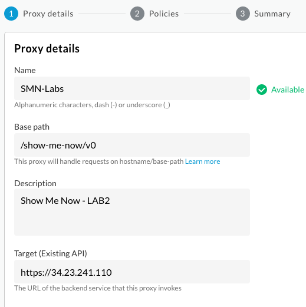

6. Double-check that the settings are correct and click __Next__.

7. Leave the Common Policies settings as the defaults. Click **Next**.

8. Leave the Optional Deployment unchecked. Click **Create**.

9. Click **Edit proxy**.

10. On the top menu, click **DEVELOP**.

    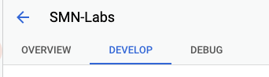

11. In the development view navigator panel, click **Target endpoints  > default >  PostFlow**.

    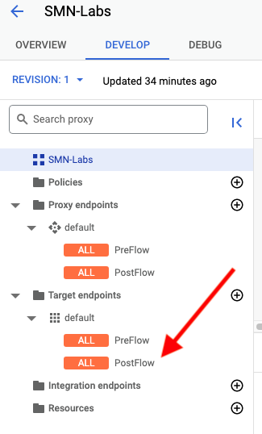

12. In the **Code** pane, locate the XML ```<HTTPTargetConnection>``` element.

13. Insert the following XML block immediately above the opening ```<URL>``` tag.

    ```xml
    <SSLInfo>
    <Enabled>true</Enabled>
    <ClientAuthEnabled>true</ClientAuthEnabled>
    <KeyStore>gateway</KeyStore>
    <KeyAlias>mtls-alias</KeyAlias>
    <TrustStore>gateway</TrustStore>
    <IgnoreValidationErrors>true</IgnoreValidationErrors>
    </SSLInfo>
    ```

    Your result should be as follows, though the indentation may vary, and the value of the IP address will match your __gateway__ VM.

    ```xml
    <HTTPTargetConnection>
        <SSLInfo>
        <Enabled>true</Enabled>
        <ClientAuthEnabled>true</ClientAuthEnabled>
        <KeyStore>gateway</KeyStore>
        <KeyAlias>mtls-alias</KeyAlias>
        <TrustStore>gateway</TrustStore>
        <IgnoreValidationErrors>true</IgnoreValidationErrors>
        </SSLInfo>
      <URL>https://34.23.241.110</URL>
    </HTTPTargetConnection>
    ```

    <ql-infobox>
    This XML enables mTLS on the target. You can safely ignore validation errors as the certificate does not contain a host name for the target. 
    </ql-infobox>

14. Click **Save**.

## Task 4. Add mTLS keys to Apigee and test

The Apigee instance requires the client certificates and the certificate authority in order establish a connection to our gateway. These are currently missing.

1. In the left navigation menu, select **Admin > Environments > TLS Keystores**. This should be empty. 

    <ql-infobox>
    <b>Note</b>: You could add your keys manually but that involves downloading them to our local machine and uploading them individually. Instead, you execute a script that calls the Apigee management API.  
    </ql-infobox>

2. Return to the previous browser tab which has Cloud console open.

3. If Cloud Shell is no longer open, in the top menu, click **Activate Cloud Shell** () to open Cloud Shell. If it is open but has disconnected, click __Reconnect__.

4. To upload the certificates generated earlier to Apigee, execute the following command.

    ```bash
    cd ~/Apigee-utils/student-scripts
    ./apigee-add-mTLS.sh 
    ```

5. Return to the browser tab that has the Apigee console open.

6. In the left navigation menu, select **Admin > Environments > TLS Keystores**. 

7. Verify that you can see the keystore __gateway__ and two keys, __Apigee__ and __CA__.

    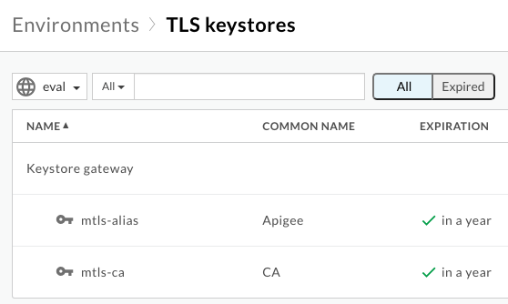

    <ql-infobox>
    If the page was already open, you may need to refresh it to see the new keystores.
    </ql-infobox>

8. In the left navigation menu, select **Develop > API Proxies > SMN-Labs** Click **Develop** and **Deploy**.

9. In the Deploy dialog, click __Deploy__.

10. In the confirm dialog, click __Confirm__ and wait until the revision has finished deploying.

11. In the top menu, click **Overview**.

12. In the Deployments section, verify that the status column has a green checkmark beside **eval** for **Revision 1**.

    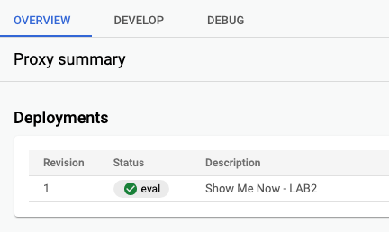

13. In the left navigation menu, select **Admin > Environments > Groups** and copy the hostname from __eval-group__. If there is more than one, copy the hostname that includes an IP Address.

    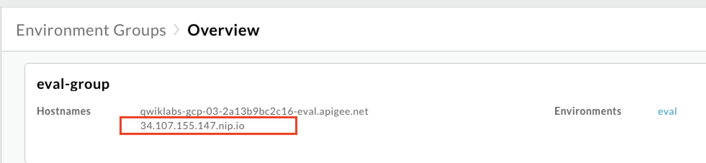

14. Open a new Chrome tab and enter the following URL, replacing APIGEEHOSTNAME with the hostname you copied in the previous step.

    ```
    https://APIGEEHOSTNAME/show-me-now/v0
    ```

    <ql-infobox>
    You should see the Shipping Tester home page. 
    </ql-infobox>

15. To verify that the methods on the tester page no longer work, attempt to use the form to return customer data.

    <ql-infobox>
    The form no longer works, but is the API secure or has the introduction of a base path broken the form?
    </ql-infobox>

16. To verify that Apigee returns data if the full path **/show-me-now/v0/v1/customers** is used, modify the URL as follows.

    ```
    https://APIGEEHOSTNAME/show-me-now/v0/v1/customers
    ```

    <ql-infobox>
    You should see all customers in JSON format. The API is not currently secure.
    </ql-infobox>

## Task 5. Fix the path and add basic security

Currently, Apigee forwards anything that is added to the end of the base path **show-me-now/v0** to the gateway, and thus to the legacy API. The test page does not add the Apigee base path to the URL, but there is nothing to stop a malicious actor from adding **/v1/customers**, or anything else, to a request to the Apigee base path, and having it forwarded to the legacy API. Access to the test page and any unwanted routes can be prevented using **Conditional Flows** and **Fault Rules**.

1. In the left navigation menu, select **Develop > API Proxies > SMN-Labs**. 

2. In the top menu, click **Develop**.

3. In the development view navigator panel, click **Proxy endpoints - default** to open the proxy endpoint in the development panel.

    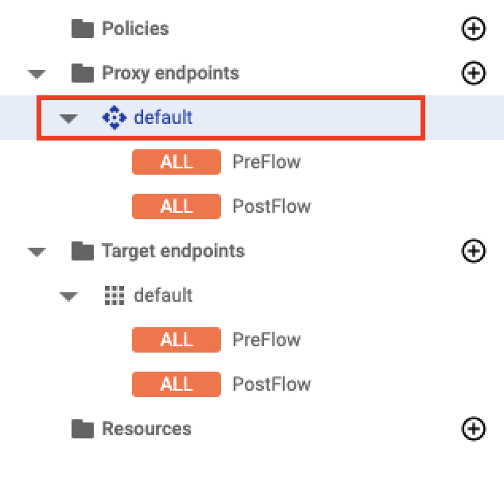

4. In the top line, click the + icon () to add a new conditional flow.

    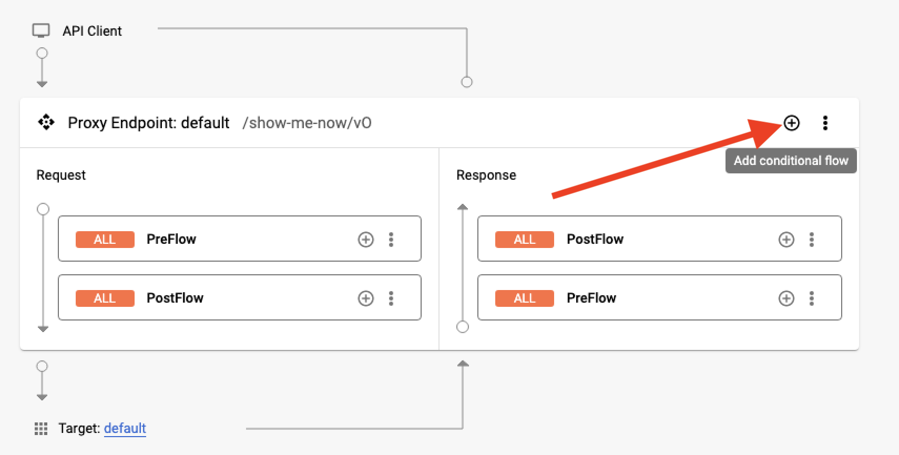

5. In the dialog, set the following properties for the New Conditional Flow and then click **Add**. 

    **Note:** The Condition is case sensitive.

    | Property | Value |
    | --- | --- |
    | Flow name | **Customers** |
    | Description | **Customer Flow** |
    | Condition type | **Path** |
    | Condition | **/customers** |

    <ql-infobox>
    The flow needs to set the correct path expected by the target API, and prevent the incoming path from being forwarded. 
    </ql-infobox>

6. In the development view navigator panel, click **Target endpoints - default** to open the target endpoint in the development panel.

    **Note:** Be sure to click the **Target** not the Proxy **endpoints**.

    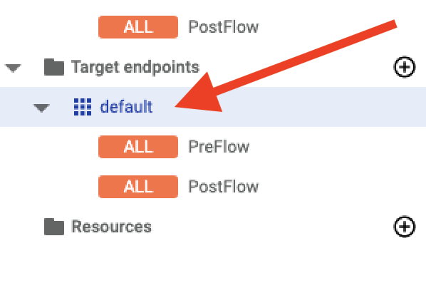

7. In the development panel, click the + icon () for the  **Target endpoints > Request > PreFlow**.

    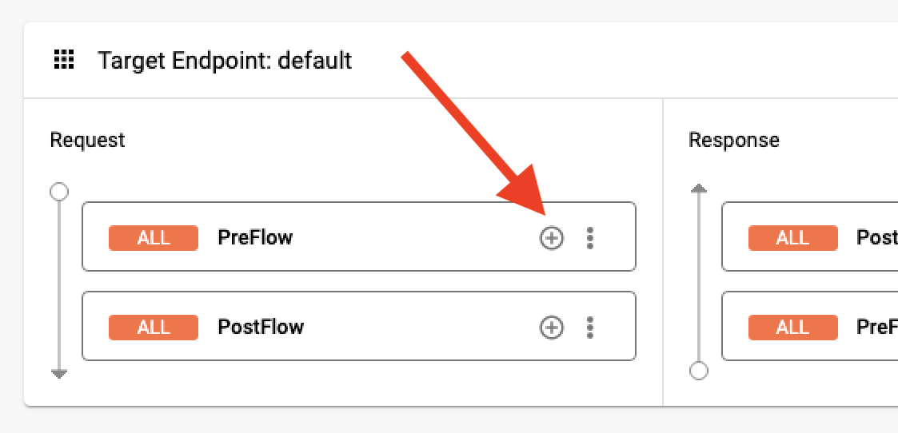

8. In the dialog, click the **Select existing policy** dropdown and select **Create new policy**. 

9. In the next dialog, from the **Mediation** group, select the **Assign Message** policy. 

10. Set the following properties and click **Create**. 

    | Property | Value |
    | --- | --- |
    | Name | **AM-remove-suffix** |
    | Display name | **AM-remove-suffix** |

    <ql-infobox>
    You are returned to the Add policy step dialog. 
    </ql-infobox>

11. In the dropdown, select **AM-remove-suffix** and click **Add**.

12. In the development panel, locate the policy inside the preflow and click the **AM-remove-suffix** link.

    <ql-infobox>
    The development panel now shows just the policy and its XML. 
    </ql-infobox>

13. Delete all the existing XML for the **AM-remove-suffix** policy and replace it with the following.

    ```xml
    <?xml version="1.0" encoding="UTF-8" standalone="yes"?>
    <AssignMessage continueOnError="false" enabled="true" name="AM-remove-suffix">
        <DisplayName>AM-remove-suffix</DisplayName>
        <Properties/>
        <AssignVariable>
            <Name>target.copy.pathsuffix</Name>
            <Value>false</Value>
        </AssignVariable>
        <IgnoreUnresolvedVariables>true</IgnoreUnresolvedVariables>
    </AssignMessage>
    ```

    <ql-infobox>
    This policy removes the Apigee base path. You now use a postflow policy and policies inside your conditional flows to create a <b>dynamic_path</b> variable to hold the correct path for the legacy API.
    </ql-infobox>

14. In the development view navigator panel, click **Target endpoints  > default >  PostFlow** to open the **Target endpoints** in the development panel with the PostFlow highlighted.

15. To amend the target URL, locate the ```<URL>``` element inside the XML panel and add the following to the end of the IP address.

    ```
    /v1/{dynamic_path}
    ```

    <ql-infobox>
    The revised element should be similar to the following, but with the IP address of your gateway.
    </ql-infobox>

    ```xml
    <URL>https://34.168.122.113/v1/{dynamic_path}</URL>
    ```

    <ql-infobox>
    The conditional flows need to create the <b>dynamic_path</b> variable so that it is available for the PostFlow.
    </ql-infobox>

16. In the development navigator panel, click **Proxy endpoints - default** to open the **Proxy** endpoint in the development panel.

17. In the development panel, click the + icon () for the **Proxy Endpoint default > Request > Customers** conditional flow.

    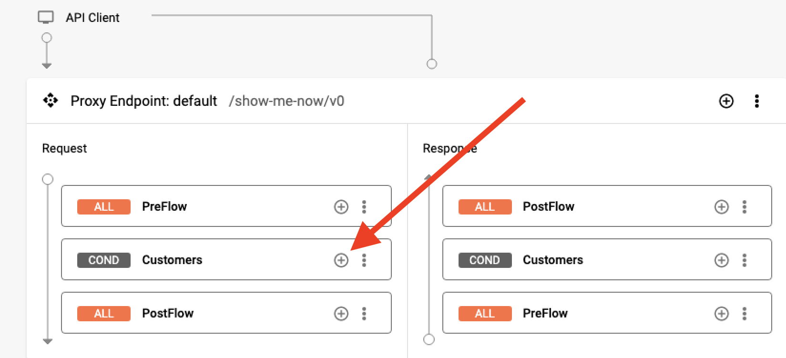

18. In the dialogs, click the **Select existing policy** dropdown, select **Create new policy** and select the **Assign Message** policy from the **Mediation** group. 

19. Set the following properties and click **Create**. 

    | Property | Value |
    | --- | --- |
    | Name | **AM-Set-Customers** |
    | Display name | **AM-Set-Customers** |

20. In the dropdown, select **AM-Set-Customers** and click **Add**.

21. In the development panel, locate the policy inside the **Customers** conditional flow and click the **AM-Set-Customers** link.

22. Delete all the existing XML for the **AM-Set-Customers** policy and replace it with the following.

    ```xml
    <?xml version="1.0" encoding="UTF-8" standalone="yes"?>
    <AssignMessage continueOnError="false" enabled="true" name="AM-Set-Customers">
        <DisplayName>AM-Set-Customers</DisplayName>
        <AssignVariable>
            <Name>dynamic_path</Name>
            <Value>/customers</Value>
        </AssignVariable>
        <AssignTo createNew="false" transport="http" type="request"/>
    </AssignMessage>
    ```

23. Click **Save** and **Deploy**.

24. In the Deploy dialog, click __Deploy__ and then __Confirm__ and wait until the revision has finished deploying.

25. To verify that revision 2 has been deployed to eval, click **Overview** and check the **Status** and **Revision 2** columns.


## Task 6. Test the path and provide a more suitable error response

The policies added in the previous task make it possible to call GET for **/customers**. The empty path **/** now returns an error message. 

1. Return to the previous browser tab where you have Cloud console and Cloud Shell open. 

    <ql-infobox>
    If you have closed the browser tab, you can open a new one and navigate to https://console.cloud.google.com/
    </ql-infobox>

2. If Cloud Shell has disconnected, click **Reconnect**. If it is closed, click the **Activate Cloud Shell** icon to reopen it.
 
3. In Cloud Shell, execute the following command to test your work, replacing APIGEEHOSTNAME with the hostname of your Apigee API.

    ```bash
    curl -k https://APIGEEHOSTNAME/show-me-now/v0/customers
    ```

    <ql-infobox>
    Recall that the hostname is available inside <b>Admin > Environments > Groups</b>
    </ql-infobox>

    **SAMPLE OUTPUT (Truncated for Readability)**

      ```
    {"apiStatus":"success","msg":"Fetching customers","result":[{"Email":"abischof1d@google.com","StreetAddress":"83480 Sachtjen Parkway","Country":"United States","FirstName":"Anastasia","Address2":"Room 496","PostalCode":"32825","LastName":"Bischof","StateOrProvince":"Florida"},{"Email":"acelle1t@boston.com","StreetAddress":"29419 Fairview Avenue","PostalCode":"33129","Country":"United States","FirstName":"Albrecht","Address2":"Room 205","LastName":"Celle","StateOrProvince":"Florida"},{"Email":"adaveran10@newsvine.com","PostalCode":"88553","Address2":"7th 
      ```

4. To verify that the route path **/** returns an error response, modify the curl command to omit the final segment of the path and execute it again.

    ```bash
    curl -k https://APIGEEHOSTNAME/show-me-now/v0/
    ```

    **SAMPLE OUTPUT**

    ```
    {"fault":{"faultstring":"Unresolved variable : dynamic_path","detail":{"errorcode":"entities.UnresolvedVariable"}}}
    ```

    <ql-infobox>
    This reponse provides implementation details that can and should be hidden from potential hackers using another Assign Message policy together with a Fault Rule.
    </ql-infobox>

5. In the Apigee environment in your other browser tab, locate and click **Target endpoints > default > PostFlow**.

6. In the XML for the PostFlow in the development pane, to catch the **.UnresolvedVariable** error, add the following FaultRule between the ```<TargetEndpoint>``` and ```<PreFlow>``` tags. 

    ```xml
    <FaultRules>
      <FaultRule name="invalid_path">
        <Step>
          <Name>AM-Nice-Try</Name>
        </Step>
        <Condition>(fault.name = "UnresolvedVariable")</Condition>
      </FaultRule>
    </FaultRules>
    ```

    <ql-infobox>
    You can safely ignore any warning that the AM-Nice-Try policy does not exist, as you are about to create it.
    </ql-infobox>

7. In the Navigator window **Policies** section, click the + icon () to add a Policy.

    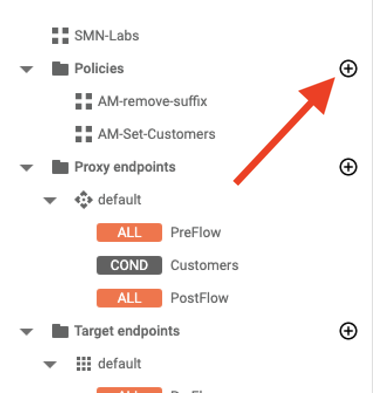

8. In the Create dialog, select the **Assign Message** policy from the **Mediation** group. 

9. Set the following properties and click **CREATE**. 

    | Property | Value |
    | --- | --- |
    | Name | **AM-Nice-Try** |
    | Display name | **AM-Nice-Try** |

10. In the policy editor pane, remove all the current XML and replace it with the following.

    ```xml
    <?xml version="1.0" encoding="UTF-8" standalone="yes"?>
    <AssignMessage continueOnError="false" enabled="true" name="AM-Nice-Try">
        <DisplayName>AM-Nice-Try</DisplayName>
        <Properties/>
        <Set>
            <Payload contentType="application/json">
                {"error_message": "Nice Try :-)" }
            </Payload>
        </Set>
        <IgnoreUnresolvedVariables>true</IgnoreUnresolvedVariables>
        <AssignTo createNew="false" transport="http" type="response"/>
    </AssignMessage>
    ```

11. Save and deploy the application.

    <ql-infobox>
    The application deploys as version 3.
    </ql-infobox>

12. In Cloud Shell, execute the following command to test your work, replacing APIGEEHOSTNAME with the hostname of your Apigee API.

    ```bash
    curl -k https://APIGEEHOSTNAME/show-me-now/v0/
    ```

    **SAMPLE OUTPUT**

    ```bash
    {"error_message": "Nice Try :-)" }
    ```


### **Congratulations!** You have implemented mTLS authentication to the legacy API, filtered out the test page and set up the framework to validate content. There is still work to be done. The API can still be abused and it is still open to the internet!


## BONUS:

The Suppliers and Shipments paths are both unsecured. In the bonus, you create new conditional flows that are very similar to the one used by Customers.


1. Create two additional conditional flows in the default Proxy endpoint with the following settings. In each case, the **Condition** is case sensitive.

    | Property | Value |
    | --- | --- |
    | Flow name | **Suppliers** |
    | Description | **Suppliers Flow** |
    | Condition type | **Path** |
    | Condition | **/suppliers** |


    | Property | Value |
    | --- | --- |
    | Flow name | **Shipments** |
    | Description | **Shipments Flow** |
    | Condition type | **Path** |
    | Condition | **/shipments** |

2. Verify you now have three conditional flows.

    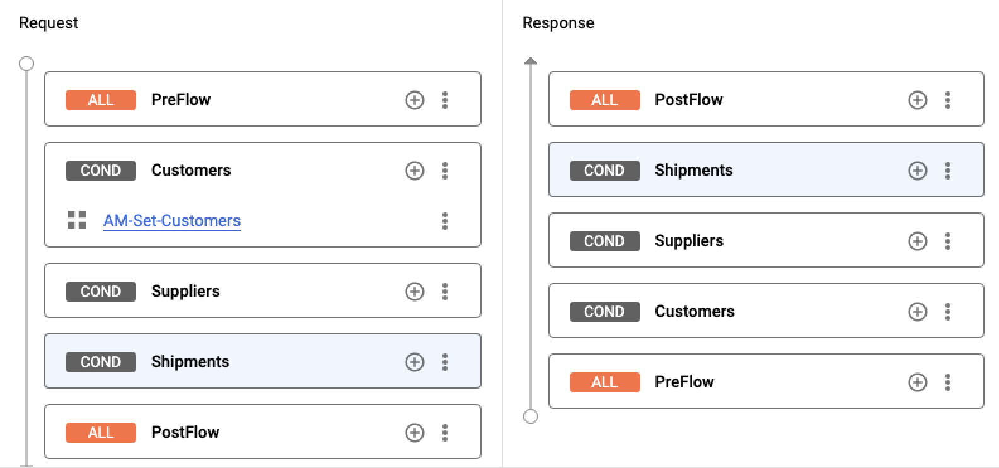

    <ql-infobox>
    The Suppliers and Shipments conditional flows require similar policies to the Customers conditional flow.
    </ql-infobox>

3. Create a new **AM-Set-Suppliers** AssignMessage policy for the Suppliers conditional flow.

4. Delete all the existing XML for the **AM-Set-Suppliers** policy and replace it with the following.

    ```xml
    <?xml version="1.0" encoding="UTF-8" standalone="yes"?>
    <AssignMessage continueOnError="false" enabled="true" name="AM-Set-Suppliers">
        <DisplayName>AM-Set-Suppliers</DisplayName>
        <AssignVariable>
            <Name>dyanmic_path</Name>
            <Value>/suppliers</Value>
        </AssignVariable>
        <AssignTo createNew="false" transport="http" type="request"/>
    </AssignMessage>
    ```

5. Create a new **AM-Set-Shipments** AssignMessage policy for the Shipments conditional flow.

6. Delete all the existing XML for the **AM-Set-Shipments** policy and replace it with the following.

    ```xml
    <?xml version="1.0" encoding="UTF-8" standalone="yes"?>
    <AssignMessage continueOnError="false" enabled="true" name="AM-Set-Shipments">
        <DisplayName>AM-Set-Shipments</DisplayName>
        <AssignVariable>
            <Name>dyanmic_path</Name>
            <Value>/shipments</Value>
        </AssignVariable>
        <AssignTo createNew="false" transport="http" type="request"/>
    </AssignMessage>
    ```

7. Save and deploy the application.

    <ql-infobox>
    The application deploys as version 4.
    </ql-infobox>

8. In Cloud Shell, execute the following commands individually to test your work, replacing APIGEEHOSTNAME with the hostname of your Apigee API.

    ```bash
    curl -k https://APIGEEHOSTNAME/show-me-now/v0/suppliers  
    curl -k https://APIGEEHOSTNAME/show-me-now/v0/shipments
    ```

    <ql-infobox>
    Both commands should successfully return data.
    </ql-infobox>


![[/fragments/copyright]]
