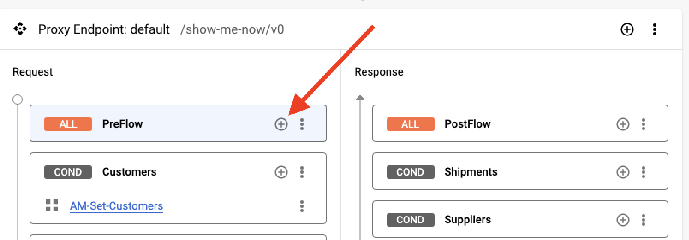

# Securing the API with an API Key

## Overview

In this lab, you add an API Key to your proxy to prevent unauthorized access and to track usage.

## Objectives

In this lab, you learn how to:
- Implement a Verify API Key policy
- Add a developer and application
- Verify that the proxy is now secure

## Setup and Requirements

![[/fragments/start-qwiklab]]


![[/fragments/cloudshell]]


![[/fragments/apigeex-console]]


## Task 1. Locate your proxy and update the metadata

1. In a separate browser tab from Google Cloud console, open the Apigee console at [apigee.google.com](https://apigee.google.com/).

    Alternatively, to open the Apigee console from the Google Cloud console Navigation menu (), select **Tools > Apigee**.
    
2. Verify that your Apigee Organization is selected at the top of the console.

3. In the left navigation menu, select **Develop > API Proxies**.

4. From the proxy list, select **SMN-Labs**. To switch to the development view, click **Develop**.

5. In the development navigation panel, click the proxy name **SMN-LAB2**.

    

5. To edit the metadata, click the pencil icon beside **Details**.

    

6. Enter the following values in the dialog.

    | Property | Value |
    | --- | --- |
    | Display name | **SMN-Lab3** |
    | Description | **Show Me Now - LAB 3** |

## Task 2: Add a Verify API Key policy (VAK) to your API proxy

1. In the development view navigator panel, click **Proxy endpoints > default** to open the Proxy endpoint in the development panel.

    **Note:** Be sure to click the **Proxy** not the Target **endpoints**.

    

2. In the development panel, click the + icon () for the **Proxy endpoints default > Request > PreFlow** to create a new policy.

    

3. In the dialog, click the **Select existing policy** dropdown and select **Create new policy**. 

4. In the next dialog, select the **Verify API Key** policy from the **Security** group. 

5. Set the following properties and click **Create**. 

    | Property | Value |
    | --- | --- |
    | Name | **VAK-API-Key** |
    | Display name | **VAK-API-Key** |

    <ql-infobox>
    You are returned to the Add policy step dialog. 
    </ql-infobox>

6. In the dropdown, select **VAK-API-Key** and click **Add**.

7. In the development panel, locate the policy inside the Preflow and click the **VAK-API-Key** link.

8. Inside the XML, locate the ```<APIKey>``` element and modify the configuration to expect the API key as a header rather than a query parameter.

    **Replace:**

    ```xml
    <APIKey ref="request.queryparam.apikey"/>
    ```

    **With:**

    ```xml
    <APIKey ref="request.header.apikey"/>
    ```

9. Click **Save** and **Save as new revision**.

10. Click **Deploy** to open the dialog, click **Deploy** in the dialog, and finally click **Confirm** in the second dialog.


## Task 3: Create an API Product

1. In the left navigation menu, select **Publish > API Products**.

2. To create a new API product, click **+Create**.

3. In the **Product details** pane, specify the following, leaving **Environment** blank.

    | Property | Value |
    | --- | --- |
    | Name | **show-me-now** |
    | Display name | **Show Me Now** |
    | Description | **Show Me Now Full API Access** |
    | Environment |  |
    | Access | **Private** |

4. Leave the **Automatically approve access requests** checkbox selected.

5. In the **Operations** section, click **+Add an Operation**.

    <ql-infobox>
    Operations are used to specify which requests in which API proxies are allowed for an application associated with the API product. 
    </ql-infobox>

6. In the **Operation** dialog, specify the following.

    | Property | Value |
    | --- | --- |
    | Source | **API Proxy > SMN-Labs** |
    | Operation | Path  __/**__ |
    | Methods | **GET, PATCH, POST, PUT and DELETE** |

7. To save the operation, click **Save**.

8. To save the API product, click **Save** at the top of the page.

9. To verify that your API product has been added, return to the API Products page and check that it is listed.


## Task 4: Create a developer

Developers are typically created using a developer portal. Developers create Apps that use API Products.

1. In the left navigation menu, select **Publish > Developers**.

2. To create a new Developer, click **+Developer**.

3. In the **Create a developer** page, specify the following.

    | Property | Value |
    | --- | --- |
    | First Name | **Anastasia** |
    | Last Name | **Bischof** |
    | Username | **ab1d** |
    | Email | **abischof1d@google.com** |

4. To create the app developer, click **Create**.


## Task 5: Create an app

In this task, you create an app for your app developer. The app represents the application that consumes the API Product/API Proxy.

1. In the left navigation menu, select **Publish > Apps**.

2. To create a new app, click **+App**. You may need to refresh the browser window for this button to be active.

3. In the **New app** page **App details** panel, specify the following.

    | Property | Value |
    | --- | --- |
    | Name | **show-me-now-web** |
    | Display Name | **Show Me Now - Web Client** |
    | Developer | **abischof1d@google.com** |

4. In the **Credentials** panel, click **Add Product**, select **Show Me Now**, and then click **ADD(1)**.

5. To create the app, click **Create** at the top of the page.

6. In the Credentials panel, click **Show** next to **Key** and copy the value. Save the key as you need it for the next task.


## Task 6: Testing the key

1.  In the left navigation menu, select **Admin > Environments > Groups** and copy the hostname from __eval-group__. Save the hostname so that it is available for the following steps.

    

2. Return to the browser tab which has Cloud console open. If none are available, open a new tab and navigate to https://console.cloud.google.com.

3. In the top menu, click **Activate Cloud Shell** () to open Cloud Shell.

4. To test your Key, execute the following command replacing **APIGEE_URL** with the Apigee Hostname and **KEY_HERE** with the key you copied earlier from your API Product. 

    **Note**: The API Key must be placed *before* the closing ”.

    ```bash
    curl -k APIGEE_URL/show-me-now/v0/customers \
    -H "apikey:KEY_HERE"
    ```

    **Example:**

    ```bash
    curl -k https://api.roiapigee.net/show-me-now/v0/customers \
    -H "apikey:giJbIK8n6Udq6TVcrpf4lImldRM0Far4CSAUAGYtsXD60rvv"
    ```

    <ql-infobox>
    You should see all customers in JSON format.
    </ql-infobox>


### **Congratulations!** You implemented an API key. The API proxy is now secure from unauthorized access but remains vulnerable to data leakage and injection attacks.


![[/fragments/copyright]]
